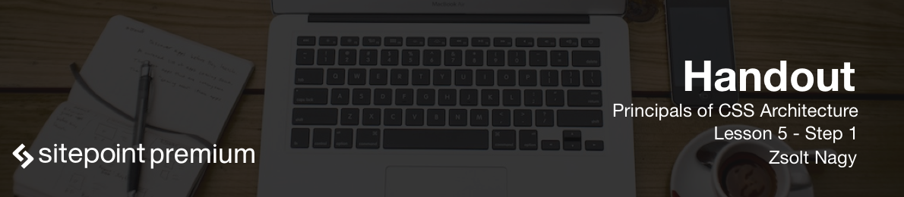

In this lesson, we're going to put theory into practice and we're going to create a stylesheet using the ITCSS Architecture. 

Let's start with the application set up, we will first introduce what the application will be about. Then we're going to set up Sass for ourselves and we'll conclude this video with creating the ITCSS file structure. Our task is going to be fairly straightforward, we will create a component library. This component library is going to include a text field that can either be short or long, a textarea, a check box, a radio button, a select component and a button. We will use the Sass pre-processor in this lesson, you could also use Less if you wanted to, and in theory you could even get away without using any pre-processors at all.

Sass is advertised as CSS with superpowers, and Sass is our number one choice when it comes to pre-processing CSS. Its rich features support our CSS architecture goals, and also support writing maintainable CSS in general.

Create a test CSS file with some random styles. We're going to compile this file into a simple *test.scss* file. The command for the compilation is `sass --watch test.scss:test.css`. The `--watch` flag makes sure that it's going to listen for any changes in the .scss file.

Next, create a CSS folder where we will place all our *.scss* files. The *main.scss* file is going to be our main entry point. In the *main.scss* file we can import all seven layers:

```css
@import "settings";

@import "tools";

@import "generic";

@import "elements";

@import "objects";

@import "components";

@import "trumps";
```

Make sure that the top layer stays at the top and the bottom layer stays at the bottom. Create all the imported files, but with a preceding underscore: for instance, *tools* becomes *_tools.scss*.

